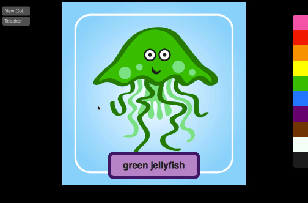

# Watermelon

> A Vue-based *WH-* question game for ESL learners



One ESL learner is the "Watermelon" and must answer questions using the selected image. Other learners ask *WH-* questions in an effort to make the "Watermelon" laugh. Discourage mean questions. **Works great on interactive whiteboards.**

## How to use

After adding images and building the app, open `index.html`. Images can be toggled on or off until one remains. Click the image or refresh the window for new random board.

## Ideas
 * What's your name? My name is \[watermelon].
 * How old are you? I'm 7 [watermelons] old.
 * Where do you live? I live in a \[watermelon].
 * What does your teacher look like? He looks like a \[watermelon].

## Build Setup

If you want the images to be colourized, you'll need to make the "coloured" portion of the image transparent.

``` bash
# install dependencies
npm install

# Add some images to the `images` folder. (sample images from placehold.it)
# each image should be its name with hyphens.
# don't add colour to the name (that will be added later).
# ie. `my-supar-sellable-thing.jpg`
npm run imgjson

# serve with hot reload at localhost:8080
npm run dev

# build for production with minification
npm run build
```
